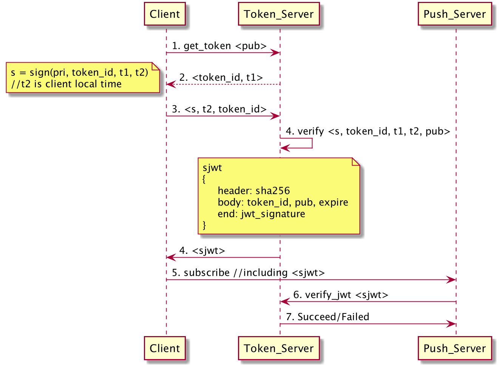
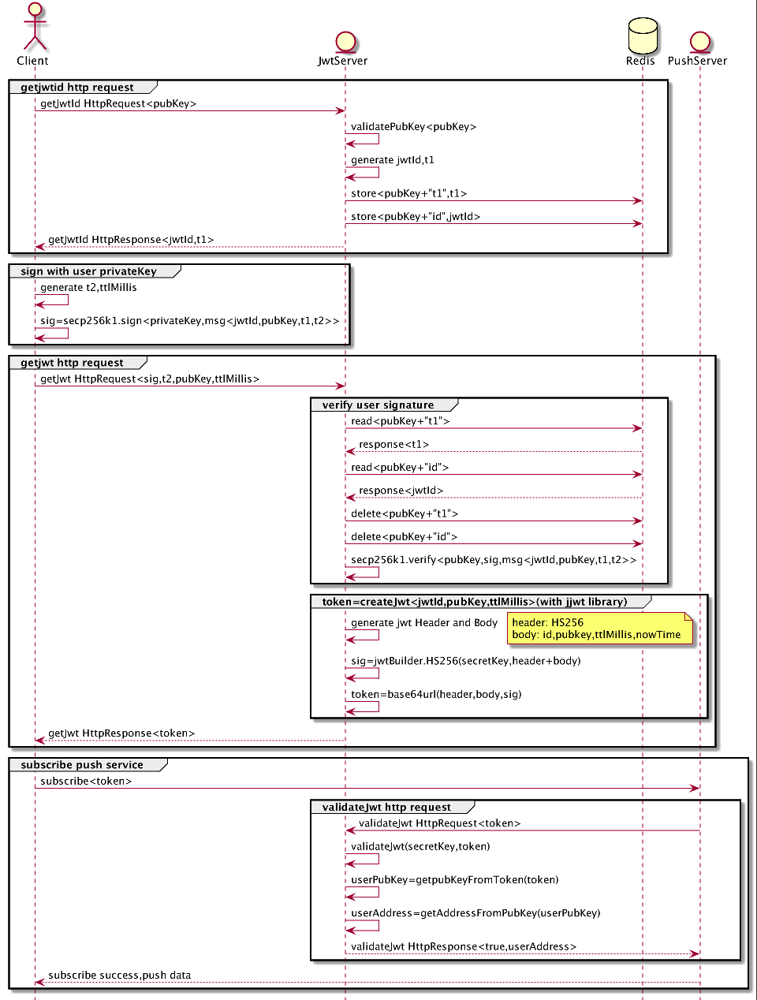

## websocket v1-data subscription format ## subscription details

**1. Address：**

Online: (under development)

**2. Format**

Request format:

::

    {"op": "<value>", "args": ["<value1>","<value2>"]}

op: 1—subscribe; 2-- unsubscribe; 3--login

args: name of channel, for defining one or more channels successful
response format:

.. code:: json

      {"event": "<value>","channel":"<value>"}
      {"table":"channel","data":"[{"<value1>","<value2>"}]"}

In the spot/depth channel, the return formats for distinguishing between
the first full data and the subsequent updated data are:

::

    {"table":"channel", "action":"partial","data":"[{"<value1>","<value2>"}]"}
    {"table":"channel", "action":"update","data":"[{"<value1>","<value2>"}]"}

failed response format:

.. code:: json

    {"event":"error","message":"<error_message>","errorCode":"<errorCode>"}

**3. Subscription**

channel is the specific name of the business. If the name of channel
consists of more than one words, they will be connected with an
underscore " \_ ".

Example: ``"spot/ticker:ACOIN-USDT"or "spot/margin_account:ACOIN-USDT"``

Example:

send:

::

    {"op": "subscribe", "args": ["spot/ticker:BCOIN-USDT","spot/candle60s:BCOIN-USDT"]}

response:

::

     {"event":"subscribe","channel":"spot/ticker:BCOIN-USDT"}

     {"event":"subscribe","channel":"spot/candle60s:BCOIN-USDT"}

     {"table":"spot/ticker","data":[{"instrument_id":"BCOIN-USDT","last":"8.8","best_bid":"3","best_ask":"8.1","open_24h":"5.1","high_24h":"8.8","low_24h":"3",
     "base_volume_24h":"13.77340909","quote_volume_24h":"78.49886361","timestamp":"2018-12-20T03:13:41.664Z"}]}

     {"table":"spot/candle60s","data":[{"candle":["2018-12-20T06:18:00.000Z","8.8","8.8","8.8","8.8","0"],"instrument_id":"BCOIN-USDT"}]}

**4. Unsubscription**

Example:

Send:

::

    {"op": "unsubscribe", "args": ["spot/ticker:ACOIN-USDT", "spot/candle60s:ACOIN-USDT"]}

Response:

::

    {"event":"unsubscribe","channel":"spot/ticker:ACOIN-USDT"}
    {"event":"unsubscribe","channel":"spot/candle60s:ACOIN-USDT"}

**5. Login**

Login subscription format:

::

    {"op":"dex_login","args":["token"]

Response：

::

    {"event":"dex_login","success":"true"}

Example:

::

    {"op":"login","args":["token"]}

token is\ ``<s, token_id, t1, t2, pub>``, authentication and work flow
details are shown below.

-  Authentication details:

-  Work flow details:

**6. Checksum**

This function helps users verify the accuracy of market depth data.

Every time when market depth data is pushed, a timestamp and a checksum
value are returned together. A total of 200 entries of market depth data
will be returned after the subscription is successfully established. The
market depth data afterwards is incremental. Each time the incremental
data is pushed, the crc 32 value comprised of the first 25 strings (bids
and asks) of the latest 200 entries of market depth data should be
calculated by the users. And the result should be compared with the
checksum value provided together with the latest incremental data. If
the checksum values are the same, the connection is correctly
established, otherwise please re-subscribe the channel.

Notes on depth aggregation: A total of 200 entries of depth data will be
returned after the subscription is successfully established, and the
depth data received afterwards is incremental. Then the 200 entries of
ask and bid price data array shall be traversed with the incremental
data. Refer to the quantity if identical prices are founded. If the
quantity is 0, delete the corresponding data entries; if the quantity
has changed, replace the original data entries; if no prices are not
identical, sort the entries by size.

Calculation description: The checksum value is a signed integer (32 bit)

Checksum strings consist of ask and bid prices and order sizes connected
by colons, eg.

**Example 1: The bid data aligns with the ask data, the checksum string
will be: bid:ask:bid:ask:…**

::

    "data": [{
            "instrument_id": "ACOIN-USDT",
            "asks": [["3366.8", "9", 10],[ "3368","8",3]],
            "bids": [["3366.1", "7", 0],[ "3366","6",3 ]],
            "timestamp": "2018-12-04T09:38:36.300Z",
            "checksum": -1881014294
        }]

The checksum string of this example will be:
**3366.1:7:3366.8:9:3366:6:3368:8**

**Example 2: The bid data does not align with the ask data, the checksum
string will be: bid:ask:ask:ask:…**

::

    "data": [{
            "instrument_id": "ACOIN-USDT",
            "asks": [["3366.8", "9", 10],[ "3368","8",3],[ "3372","8",3 ]],
            "bids": [["3366.1", "7", 0]],
            "timestamp": "2018-12-04T09:38:36.300Z",
            "checksum": 831078360
        }]

The checksum string of this example will be:
**3366.1:7:3366.8:9:3368:8:3372:8**

**The pushed data that the user receives in the depth channel are:**

First 200 entries

::

    {
        "table": "spot/depth",
        "action": "partial",
        "data": [{
            "instrument_id": "BCOIN-USDT",
            "asks": [
                ["8.8", "96.99999966", 1],
                ["9", "39", 3],
                ["9.5", "100", 1],
                ["12", "12", 1],
                ["95", "0.42973686", 3],
                ["11111", "1003.99999795", 1]
            ],
            "bids": [
                ["5", "7", 4],
                ["3", "5", 3],
                ["2.5", "100", 2],
                ["1.5", "100", 1],
                ["1.1", "100", 1],
                ["1", "1004.9998", 1]
            ],
            "timestamp": "2018-12-18T07:27:13.655Z",
            "checksum": 468410539
        }]
    }

Incremental:

::

    {
        "table": "spot/depth",
        "action": "update",
        "data": [{
            "instrument_id": "ACOIN-USDT",
            "asks": [],
            "bids": [
                ["3983", "789", 0]
            ],
            "timestamp": "2018-12-04T09:38:36.300Z",
            "checksum": -1200119424
        }]
    }

channel list
------------

public channels
~~~~~~~~~~~~~~~

-  dex\_spot/ticker
-  **dex\_spot/all\_tickers\_3s (supported)**
-  dex\_spot/candle60s // 1 min
-  dex\_spot/candle180s // 3 mins
-  dex\_spot/candle300s // 5 mins
-  dex\_spot/candle900s // 15 mins
-  dex\_spot/candle1800s // 30 mins
-  dex\_spot/candle3600s // 1 hr
-  dex\_spot/candle7200s // 2 hrs
-  dex\_spot/candle14400s // 4 hrs
-  dex\_spot/candle21600s // 6 hrs
-  dex\_spot/candle43200s // 12 hrs
-  dex\_spot/candle86400s // 1 day
-  dex\_spot/candle604800s // 1 week
-  **dex\_spot/matches // transaction information **
-  dex\_spot/optimized\_depth // depth data, 200 entries for the first
   time, then incremental
-  dex\_spot/account // account information, subscription by
   cryptocurrency (private in v2)
-  dex\_spot/order // unfilled orders (private in v2)

private channels
~~~~~~~~~~~~~~~~

-  dex\_spot/account // account information, subscription by
   cryptocurrency (private in v2)）
-  dex\_spot/order // unfilled orders (private in v2)

details
~~~~~~~

1. spot account channels (cryptocurrency symbol)
^^^^^^^^^^^^^^^^^^^^^^^^^^^^^^^^^^^^^^^^^^^^^^^^

TODO: Login of direct developers

send example

::

    {"op": "subscribe", "args": ["dex_spot/account:mycoin"]}
    {"op": "subscribe", "args": ["dex_spot/account:bcoin-190628"]}

of which dex\_spot/account is a channel name，\ ``okt`` and
``usd-190628`` are the names of cryptocurrencies

response example

::

    {
        "table":"dex_spot/account",
        "data":[
            {
                "symbol": "okt",
                "available": "100.00000000",
                "freeze": "0",
                "locked": "1.00000000"
            }
        ]
    }

    {
        "table":"dex_spot/account",
        "data":[
            {
                "symbol": "acoin-190628",
                "available": "100.00000000",
                "freeze": "0",
                "locked": "1.00000000"
            }
        ]
    }

2. Channel of unfilled orders (pair products)
^^^^^^^^^^^^^^^^^^^^^^^^^^^^^^^^^^^^^^^^^^^^^

Obtain transaction data without login

send example

::

    {"op": "subscribe", "args": ["dex_spot/order:*"]}

of which ``dex_spot/order`` is a channel name. \* refers to all trading
pairs.

response example

::

    {
        "table":"dex_spot/order",
        "data":[
            {
                "txHash": "E3B0C44298FC1C149AFBF4C8996FB92427AE41E4649B934CA495991B7852B855",
                "orderId": "ID0000000003-1",
                "sender": "okchain1me20p6j8tddxsgezfg3ceezsaq35jea9r2mc00",
                "product": "mycoin_okt",
                "side": "BUY",
                "price": "0.10000000",
                "quantity": "1.00000000",
                "status": 0, //(0-5) -> (Open, Filled, Cancelled, Expired, PartialFilledCancelled, PartialFilledExpired)
                "filledAvgPrice": "0.00000000",
                "remainQuantity": "1.00000000",
                "timestamp": -62135596800
            }
        ]
    }

3. Channel of tickers (pair products)
^^^^^^^^^^^^^^^^^^^^^^^^^^^^^^^^^^^^^

send example

::

    {"op": "subscribe", "args": ["dex_spot/ticker:acoin-190628_okt"]}

of which ``dex_spot/ticker`` is a channel name，\ ``ETH-USDT`` is a
product

response example

::

    {
        "table":"dex_spot/ticker",
        "data":[
            {
                "close":"397.2",
                "price":"396.93",
                "high":"405.35",
                "low":"392.73",
                "volume":"119769",
                "product":"BCOIN-USD-190628",
                "symbol":"BCOIN-USD-190628",
                "timestamp":"2019-05-08T02:26:09.409Z"
            }
        ]
    }

4. Channel for full data tickers (all pair products)
^^^^^^^^^^^^^^^^^^^^^^^^^^^^^^^^^^^^^^^^^^^^^^^^^^^^

Client subscription format

send example

::

    {"op":"subscribe","args":"dex_spot/all_ticker_3s"}

response example

::

    Front-end calculation of rise/fall
    {
        "table":"dex_spot/all_ticker_3s",
        "data":[
          {
                "id":"ACOIN-USDT", # id = name of cryptocurrency
                "p": "13.0000", # price = close price
                "o": "13.8366", # 24 hour open
                "l": "12.7930", # 24 hour low
                "h": "14.3994", # 24 hour high
                "v": "3184726.3100" # 24 hour volume
          },
          {
                "id":"BCOIN-USDT",
                "p": "14.0000",
                "o": "13.8366",
                "l": "17.7930",
                "h": "11.3994",
                "v": "1134746.3100"
    } ] }

5. Candlestick data
^^^^^^^^^^^^^^^^^^^

send example

::

    {"op": "subscribe", "args": ["dex_spot/candle60s:acoin-190628_okt"]}

of which ``dex_spot/candle60s``\ is a channel name，\ ``ACOIN-USDT`` is
a product

response example

.. code:: JSON

    {
        "table":"dex_spot/candle60s",
        "data":[
            {
                "candle":[
                    "2019-04-16T10:49:00.000Z",
                    "162.03",
                    "162.04",
                    "161.96",
                    "161.98",
                    "336.452694"
                ],
                "instrument_id":"acoin-190628_okt"
            }
        ]
    }

6. Depth channel (pair products)
^^^^^^^^^^^^^^^^^^^^^^^^^^^^^^^^

200 entries for the first time, then incremental

send example

::

    {"op": "subscribe", "args": ["dex_spot/optimized_depth:acoin-190628_okt"]}

of which ``dex_spot/optimized_depth``\ is a channel name,
``acoin-190628_okt`` is instrument\_id

response example

the first 200 entries:

.. code:: JSON

    {
        "table":"dex_spot/optimized_depth",
        "action":"partial",
        "data":[
            {
                "instrument_id":"acoin-190628_okt",
                "asks":[
                    [
                        "162.5",
                        "14.29884",
                        2
                    ],
                    [
                        "162.51",
                        "2.084362",
                        1
                    ],
                   ...

                    [
                        "168.51",
                        "7.760755",
                        2
                    ],
                    [
                        "168.57",
                        "0.02",
                        1
                    ]
                ],
                "bids":[
                    [
                        "162.49",
                        "1.556106",
                        3
                    ],
                    [
                        "162.47",
                        "0.00913",
                        1
                    ],
                   ...

                    [
                        "155.15",
                        "70",
                        1
                    ],
                    [
                        "155.13",
                        "3",
                        1
                    ]
                ],
                "timestamp":"2019-04-16T10:17:28.507Z",
                "checksum":1141851215
            }
        ]
    }

incremental:

.. code:: JSON

    {
        "table":"dex_spot/optimized_depth",
        "action":"update",
        "data":[
            {
                "instrument_id":"BCOIN-USDT",
                "asks":[
                    [
                        "162.5",
                        "0",
                        0
                    ],
                    [
                        "162.61",
                        "1.209",
                        2
                    ],
                    [
                        "168.69",
                        "0.006",
                        1
                    ],
                    [
                        "168.73",
                        "0.002082",
                        1
                    ]
                ],
                "bids":[
                    [
                        "162.49",
                        "1.512544",
                        2
                    ],
                    [
                        "162.47",
                        "0.05333",
                        2
                    ],
                    [
                        "162.46",
                        "14.608508",
                        3
                    ],
                    [
                        "162.43",
                        "10.61874",
                        3
                    ],
                    [
                        "162.41",
                        "27.303906",
                        2
                    ],
                    [
                        "162.4",
                        "14.762929",
                        6
                    ],
                    [
                        "162.39",
                        "11.045909",
                        1
                    ],
                    [
                        "162.36",
                        "19.230907",
                        8
                    ],
                    [
                        "162.31",
                        "3.927598",
                        4
                    ],
                    [
                        "162.3",
                        "5.353085",
                        5
                    ],
                    [
                        "162.29",
                        "6.569261",
                        12
                    ],
                    [
                        "162.25",
                        "8.308575",
                        3
                    ]
                ],
                "timestamp":"2019-04-16T10:17:29.045Z",
                "checksum":227291232
            }
        ]
    }

7. Channel for the latest matches (pair products)
^^^^^^^^^^^^^^^^^^^^^^^^^^^^^^^^^^^^^^^^^^^^^^^^^

send example

::

    {"op": "subscribe", "args": ["dex_spot/matches:{ADDRESS}:acoin-190628_okt"]}

of which ``dex_spot/matches`` is a channel name, ``BCOIN-USDT``\ is a
product

response example

.. code:: JSON

    {
        "table":"dex_spot/matches",
        "data":[
            {
                "timestamp": 1559790137,
                "blockHeight": 386355,
                "product": "acoin-564_okt",
                "price": 3,
                "volume": 0.25
            }]
    }

other channels
~~~~~~~~~~~~~~

-  dex\_spot/depth
-  dex\_spot/instruments

error messages
--------------

error message format:

::

    {“event”:”error”,” message”:” “,”error_code”:”“}

error message examples
~~~~~~~~~~~~~~~~~~~~~~

+------------------------------------------+---------------------------------------------------+---------+
| 错误描述                                 | Error message description                         | Code    |
+==========================================+===================================================+=========+
| Url path 无效                            | Url path error                                    | 30000   |
+------------------------------------------+---------------------------------------------------+---------+
| “OK\_ACCESS\_KEY”不能为空                | OK\_ACCESS\_KEY cannot be blank                   | 30001   |
+------------------------------------------+---------------------------------------------------+---------+
| “OK\_ACCESS\_SIGN”不能为空               | OK\_ACCESS\_SIGN cannot be blank                  | 30002   |
+------------------------------------------+---------------------------------------------------+---------+
| “OK\_ACCESS\_PASSPHRASE”不能为空         | OK\_ACCESS\_PASSPHRASE cannot be blank            | 30004   |
+------------------------------------------+---------------------------------------------------+---------+
| 无效的OK\_ACCESS\_TIMESTAMP              | Invalid OK\_ACCESS\_TIMESTAMP                     | 30005   |
+------------------------------------------+---------------------------------------------------+---------+
| 无效的OK\_ACCESS\_KEY                    | Invalid OK\_ACCESS\_KEY                           | 30006   |
+------------------------------------------+---------------------------------------------------+---------+
| 请求时间戳过期                           | Timestamp request expired                         | 30008   |
+------------------------------------------+---------------------------------------------------+---------+
| 无效的sign                               | Invalid sign                                      | 30013   |
+------------------------------------------+---------------------------------------------------+---------+
| 用户请求频率过快，超过该接口允许的限额   | Requested too frequent; endpoint limit exceeded   | 30026   |
+------------------------------------------+---------------------------------------------------+---------+
| 不合法的请求                             | Login failure                                     | 30027   |
+------------------------------------------+---------------------------------------------------+---------+
| 不合法的请求                             | Unrecognized request                              | 30039   |
+------------------------------------------+---------------------------------------------------+---------+
| 频道不存在                               | {0} Channel : {1} doesn't exist                   | 30040   |
+------------------------------------------+---------------------------------------------------+---------+
| 用户需要登录                             | User not logged in / User must be logged in       | 30041   |
+------------------------------------------+---------------------------------------------------+---------+
| 重复登录                                 | Already logged in                                 | 30042   |
+------------------------------------------+---------------------------------------------------+---------+
| 内部系统错误                             | Internal system error                             | 30043   |
+------------------------------------------+---------------------------------------------------+---------+

