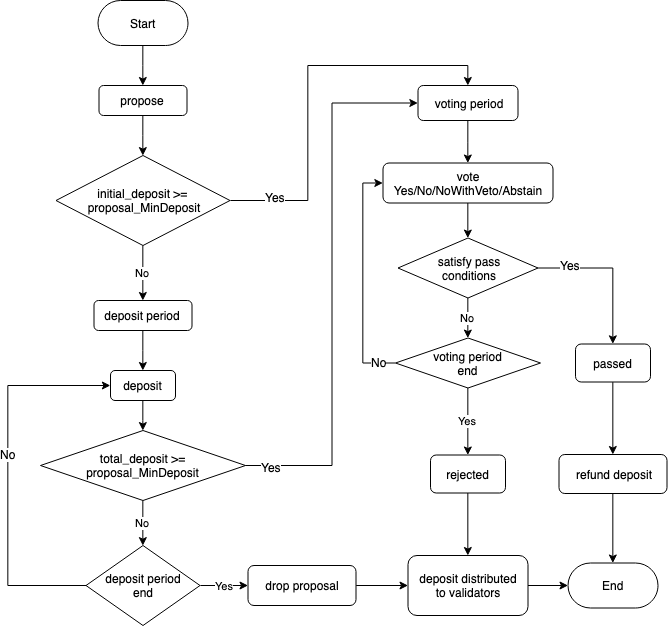
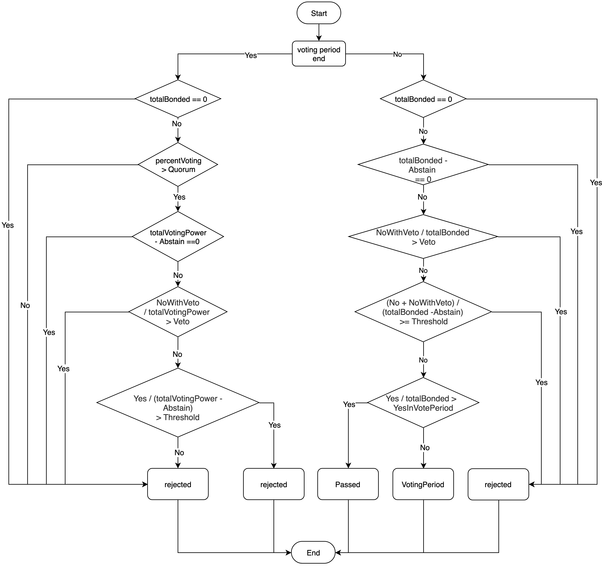

Proposal process
----------------

| The overall process of a proposal is shown below: 

|image0|

Details: 

1. The proposer should pledge okt when initiating a proposal to prevent malicious initiation of a proposal

2. The voting participants are bond okt holders, except for the following two cases:   a. the okt holder bond/unbond to proposer after entering vote\_period   b. the okt holder becomes proposer after entering vote\_period 

#. The weight of the vote depends on the number of okts in the bond

#. To prevent duplicate voting:   a. the voting period is smaller than unbond\_period. The minimum length of the voting period is 72h (adjustable depending on the type of proposals) .   b. if the delegator votes before the proposer votes on his behalf, the weight of the proposer's vote does not include the weight of okt in his bond.  c. if the delegator votes after the proposer votes on his behalf, the weight of the voting result replaces the weight of the vote cast by the proposer on behalf of the delegator

Proposal types
--------------

OKChain offers 4 types of proposals for different purposes: 

1. `Text Proposal <../governance/text.html>`__\ ： to obtain network views of a topic

#. `Parameter Proposal <../governance/parameter.html>`__\ ： to change system parameters

#. `DexList Proposal <../governance/dexlist.html>`__\ ： to help project teams list tokens

#. `Software Upgrade Proposal <../governance/upgrade.html>`__\ ： to support whole network upgrade

Except for text proposals, there are four proposal stages, including
initiation, deposit\_period, vote\_period and execution. Execution is
not a text proposal's stage.

Proposal voting statistics
--------------------------

|image1|

Meanings of variables:

1. totalBonded：the sum of bonded okt that can vote on the entire network

#. totalVotingPower：the sum of bonded okt that participate in voting 

#. percentVoting = totalVotingPower / totalBonded

#. Quorum： voting weight threshold for participating voters (0.334)

#. Threshold： weight threshold for the proportion of Yes votes to all non-abstained votes (0.5) 

#. Veto： weight threshold for the proportion of NoWithVeto votes to all votes (0.334) 

#. YesInVotePeriod： weight threshold for the proportion of Yes votes to totalBonded before the voting ends (0.667) 

#. Yes： the sum of bonded okt voting Yes 

#. No： the sum of bonded okt voting No 

#. NoWithVeto： the sum of bonded okt voting NoWithVeto 

#. Abstain： the sum of bonded okt voting Abstain

Proposal parameters
-------------------

| text proposal parameters
|   deposit period(\ ``TextMaxDepositPeriod``): 24h
|   minimum deposit(\ ``TextMinDeposit``): 100okt
|   voting period(\ ``TextVotingPeriod``): 72h
| parameter proposal parameters
|   deposit period(\ ``ParamChangeMaxDepositPeriod``): 24h
|   minimum deposit(\ ``ParamChangeMinDeposit``): 100okt
|   voting period(\ ``ParamChangeVotingPeriod``): 72h
|   maximum block height(\ ``ParamChangeMaxBlockHeight``)：100000
| software upgrade proposal parameters   deposit
|   period(\ ``AppUpgradeMaxDepositPeriod``): 24h
|   minimum deposit(\ ``AppUpgradeMinDeposit``): 100okt
|   voting period(\ ``AppUpgradeVotingPeriod``): 72h
| dexlist proposal parameters   deposit
|   period(\ ``DexListMaxDepositPeriod``): 24h
|   minimum deposit(\ ``DexListMinDeposit``): 20000okt
|   voting period(\ ``DexListVotingPeriod``): 72h
|   voting fee(\ ``DexListVoteFee``): 0okt
|   maximum block height(\ ``DexListMaxBlockHeight``): 10000
|   listing fee(\ ``DexListFee``): 100000okt
|   expiry time(\ ``DexListExpireTime``): activate within 24 hours upon approval prior to expiry
| voting parameters of all proposals: voting weight threshold for participating voters (``Quorum``)：0.334
|   weight threshold for the proportion of Yes votes to all non-abstained votes (``Threshold``)：0.5
|   weight threshold for the proportion of NoWithVeto votes to all votes (``Veto``)：0.334
|   weight threshold for the proportion of Yes votes to all votes(including the voted and unvoted) before the voting ends(``YesInVotePeriod``)：0.667

Refer to `parameter <../governance/parameter.html>`__ for details

