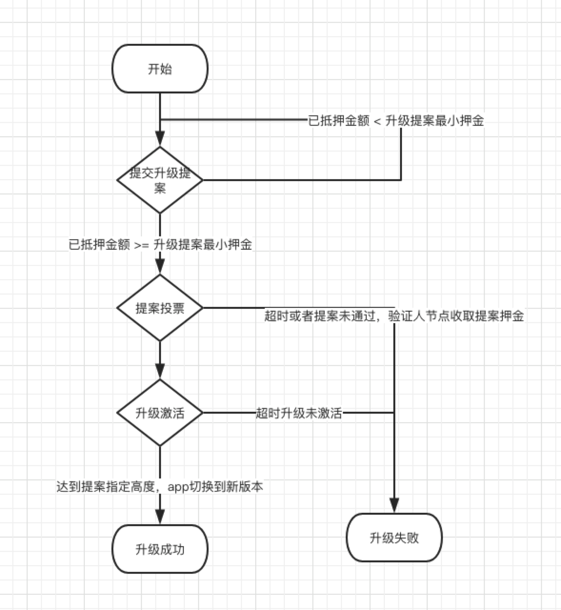

Upgrade proposal process
------------------------

Description: Compared with the traditional hard fork, app upgrade is a
smoother and more fault-tolerant system upgrade method. The app here
refers to the OKChain software running on the tendermint consensus
layer. When the app version update is completed and the new validation
node’s “voting power” is lower than a certain threshold, the new app can
continue to run based on the logic of its old version in the same
situation where the entire block network remains in the old version,
which will not result in network fork; when the new validation node’s
“voting power” reaches the threshold, the logic of its new version will
swap at a specified height, and the entire block network will run using
such logic.

Reference
---------

proposal parameters:

.. code:: sh

    - title indicates the title of the app upgrade proposal
    - description indicates a detailed description of the app upgrade proposal
    - deposit indicates the number of tokens desposited by the current proposal
    - version indicates the new version number of the app included in the current proposal
    - software indicates the download address of the app of the new version included in the current proposal
    - switchHeight indicates the swap block height of the app of the new version included in the current proposal
    - threshold indicates the threshold for 'voting power' included in the current proposal
    - type specifies the current proposal as an app upgrade proposal
    - from indicates the current proposal's initiator account, alice

